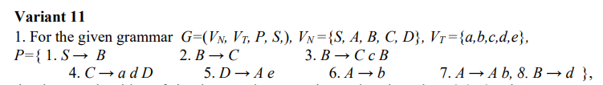

# Lab 1 LFPC Simple Precedence Parsing
##Variant No.11

## For this lab it was required to:
1.**_Implement the algorithm of simple precedence parsing and analyze a specified word_**

P.S I would like to use my bonus point for this laboratory.